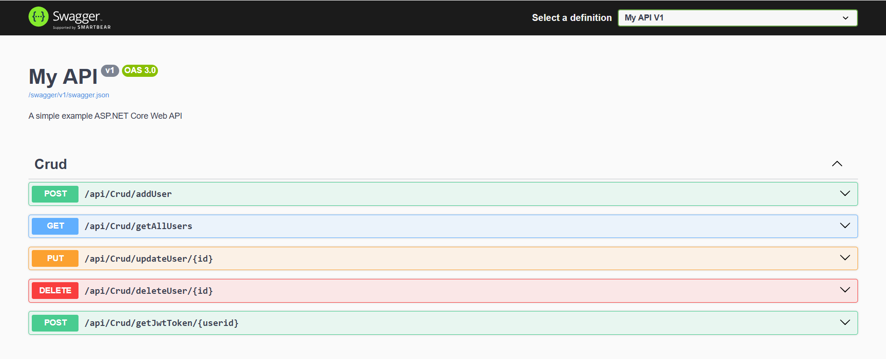

# user-with-JWTToken-management-backend-
This project is a User Management backend built using ASP.NET Core with a focus on best practices. It implements JWT-based authentication, follows the Unit of Work pattern, uses Dependency Injection, follows the Database First approach, and adheres to SOLID principles for maintainability and scalability.

# Features

User registration and authentication using JWT

Role-based authorization

Secure password hashing

Dependency Injection for better code manageability

Implementation of Unit of Work and Repository patterns

Database First approach for managing the database schema

Adherence to SOLID principles for clean architecture

# Technologies Used

ASP.NET Core Web API

Entity Framework Core (EF Core) - Database First Approach

JWT (JSON Web Token) for Authentication

SQL Server

Dependency Injection

Unit of Work Pattern

Repository Pattern

# Setup Instructions

# Prerequisites

.NET 9 SDK

SQL Server

Visual Studio / VS Code